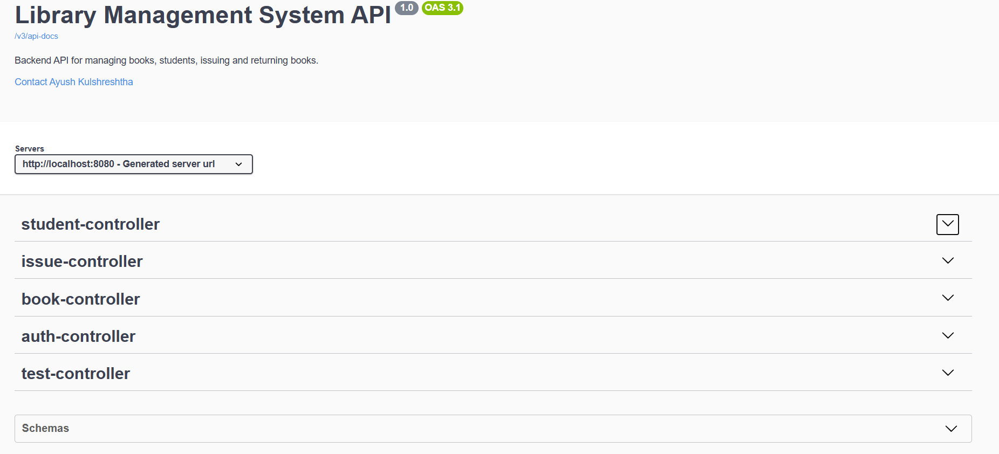
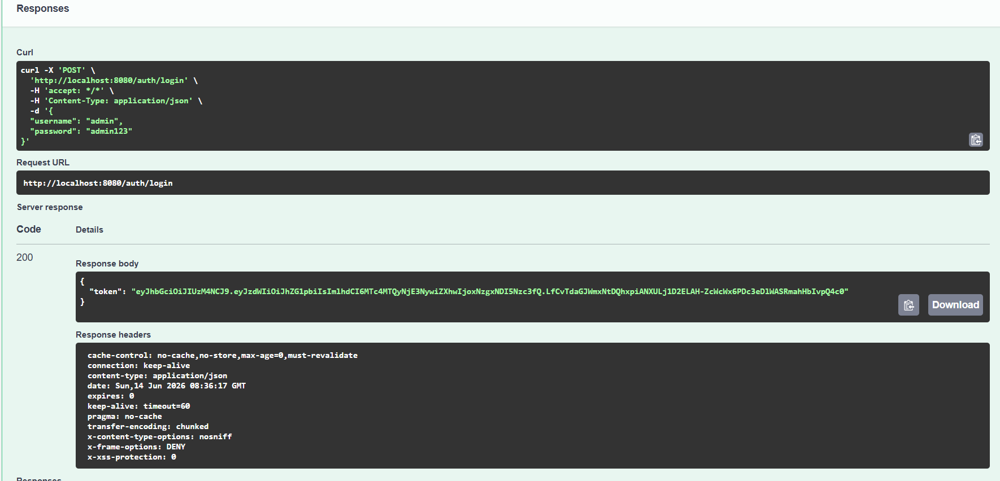
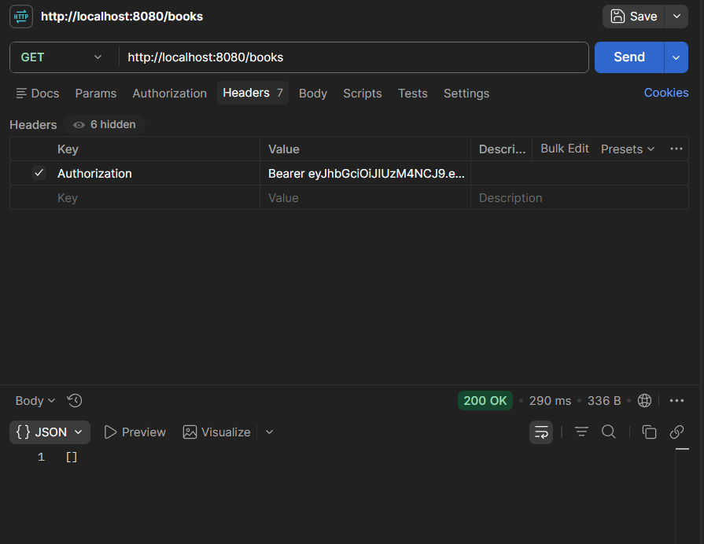
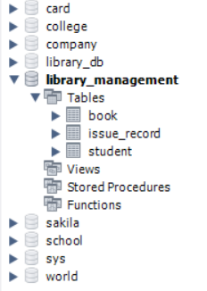

# 📚 Library Management System (Spring Boot)

A backend Library Management System built using Spring Boot, Spring Data JPA, MySQL, Spring Security, JWT Authentication, and Swagger.

## 🚀 Features

- Book Management (CRUD)
- Student Management (CRUD)
- Issue and Return Books
- Book Availability Tracking
- Input Validation
- Global Exception Handling
- Swagger API Documentation
- JWT Authentication
- Protected APIs using Spring Security
- MySQL Database Integration

## 🛠 Tech Stack

- Java 21
- Spring Boot
- Spring Data JPA
- MySQL
- Spring Security
- JWT Authentication
- Swagger / OpenAPI
- Maven

## 📂 Project Structure

controller/
service/
repository/
model/
dto/
exception/
security/
config/

## 📸 Screenshots

### Swagger Documentation



### JWT Authentication



### Protected API Access



### MySQL Database Tables



## 🔑 Authentication

Login Endpoint:

POST /auth/login

Request:

```json
{
  "username": "admin",
  "password": "admin123"
}
```

Response:

```json
{
  "token": "your-jwt-token"
}
```

## 📖 API Documentation

Swagger UI:

http://localhost:8080/swagger-ui/index.html

## ⚙️ Database

MySQL Database:

```sql
CREATE DATABASE library_management;
```

## ▶️ Run Project

```bash
mvn spring-boot:run
```

## 👨‍💻 Author

Ayush Kulshreshtha
